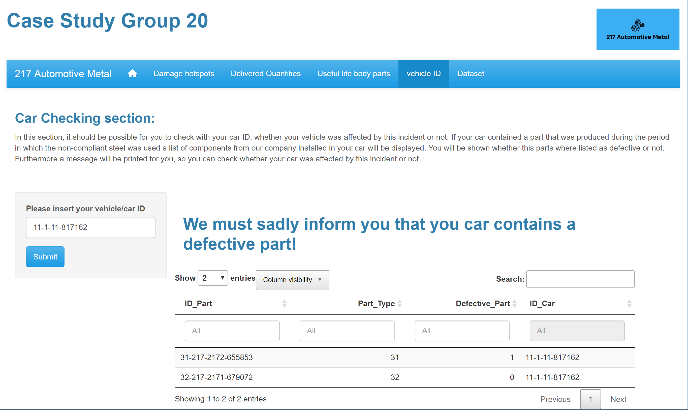

<script>
   $(document).ready(function() {
     $head = $('#header');
     $head.prepend('')
   });
</script>

```{r setup, include=FALSE}
knitr::opts_chunk$set(echo = TRUE)
```

# The Study Case and Data:

In our case study, we are employees of the fictitious company “217”, which produces sheet metal parts for vehicle bodies of German car manufacturers. Recently, there have been more and more customer complaints about premature rust spots on the company products. Intensive research revealed that this may be caused by the purchase of steel whose composition did not comply with the company’s specifications. An internal investigation revealed that this steel was processed in the company plants in the period from June 1, 2012 to July 31, 2014. Our goal is to analyze this situation with the production data and parts lists of our customers and to identify the customers and vehicles affected.Therefore we aim to identify critical production quantities, isolate them and inform customers and car manufacturers who have installed critical components in their vehicles from the available data.

We possess the information that body parts produced by our company are installed in **“Type11”, “Type12”, “Type21” and “Type22”** vehicles of **“OEM1” and “OEM2”** car brands.

Lastly, for reference, we also have the following translation which will be helpful for understanding the data:

* **Single Part = Einzelteil**
* **Component = Komponente**
* **Vehicle = Fahrzeug**
* **Geodata = Geodaten**
* **Registrations = Zulassungen**
* **Logistics delay = Logistikverzug**

# 1. Setting: 

## 1.1 Import and loading of necessary packages for the analysis: 

```{r message=FALSE, warning=FALSE}
if(!require("install.load")){
   install.packages("install.load")
}
library('install.load')
install_load("readr", "readxl", "tidyr", "dplyr", "stringr", "tidyverse", "knitr", "rmarkdown", "ggplot2","lubridate","kableExtra")

```


# 2. Importing the data:

## 2.1 Creation of a function to import poorly formatted flat files:

First, we will construct a function that will enable us to read messy flat files (.txt)
```{r warning=FALSE}

read_txt <- function(path, replacement){
  
  path %>% # Take the file from the path
    read_file() %>% # Import it as a string
    str_replace_all(replacement) %>% # Apply a specific replacement for each dataset
    str_replace_all(c("\n\"\\d+\"," = "\n", "\nNA," = "\n")) %>% # Apply general replacement
    read_delim(show_col_types = FALSE) # Read it as a dataframe
}


```

## 2.2 Identification of relevant Databases:

Recall the fact that we know our parts are installed in **“Type11”, “Type12”, “Type21” and “Type22”** vehicles of **“OEM1” and “OEM2”** car brands. Furthermore, we also know that the provided data are in the form relational databases which are combined through specific keys/IDs. Leading us to the following graph:

```{r echo=FALSE, warning=FALSE}


```

This information enabled us to identify the relevant datasets for our analysis, which are:

* **Geodaten_Gemeinden_v1.2_2017-08-22_TrR:** Geodata with latitude and longitude data of corresponding community and potcodes.
  + Geodaten_Gemeinden_v1.2_2017-08-22_TrR

* **Zulassungen_alle_Fahrzeuge:** Registration data of vehicles
  + Zulassungen_alle_Fahrzeuge

* **Fahrzeuge_ID:** Data of produced cars
  + Fahrzeuge_OEM1_Typ11
  + Fahrzeuge_OEM1_Typ12
  + Fahrzeuge_OEM1_Typ21
  + Fahrzeuge_OEM1_Typ22
  
* **Bestandteile_Fahrzeuge:** Relation table with the ID of components installed in the respective car types
  + Bestandteile_Fahrzeuge_OEM1_Typ11
  + Bestandteile_Fahrzeuge_OEM1_Typ12
  + Bestandteile_Fahrzeuge_OEM2_Typ21
  + Bestandteile_Fahrzeuge_OEM2_Typ22
  
* **Komponente:** Data files of the components installed in the car body parts
  + Komponente_k4
  + Komponente_k5
  + Komponente_k6
  + Komponente_k7
  
* **Bestandteile_Komponente:** Relational Databases, with the ID of parts installed in specific components
  + Bestandteile_Komponente_k4
  + Bestandteile_Komponente_k5
  + Bestandteile_Komponente_k6
  + Bestandteile_Komponente_k7
  
* **Einzelteile:** Data of Parts produced by our company
  + Einzelteil_T30
  + Einzelteil_T31
  + Einzelteil_T32
  + Einzelteil_T33
  + Einzelteil_T34
  + Einzelteil_T35
  + Einzelteil_T37
  
## 2.3 Importing relevant DB:

After having identified the relevant databases for our analysis, it is time to import these files:

### 2.3.1 Importing of Geodata:

```{r message=FALSE, warning=FALSE}
geodata <- read_csv2("Data/Geodaten/Geodaten_Gemeinden_v1.2_2017-08-22_TrR.csv")

```


### 2.3.2 Importing of Registrations:

```{r message=FALSE, warning=FALSE}

registrations <- read_csv2("Data/Zulassungen/Zulassungen_alle_Fahrzeuge.csv")

```

### 2.3.3 Importing of cars data:


```{r message=FALSE, warning=FALSE}

car_type11 <- read_csv("Data/Fahrzeug/Fahrzeuge_OEM1_Typ11.csv")


car_type12 <- read_csv2("Data/Fahrzeug/Fahrzeuge_OEM1_Typ12.csv")


car_type21 <- read_csv("Data/Fahrzeug/Fahrzeuge_OEM2_Typ21.csv")


car_type22 <- read_csv2("Data/Fahrzeug/Fahrzeuge_OEM2_Typ22.csv")


```


### 2.3.4 Importing of Car parts data,i.e., Bestandteile_Fahrzeuge Data:

```{r message=FALSE, warning=FALSE}

car_parts_type11 <-read_csv2("Data/Fahrzeug/Bestandteile_Fahrzeuge_OEM1_Typ11.csv")


car_parts_type12 <-read_csv2("Data/Fahrzeug/Bestandteile_Fahrzeuge_OEM1_Typ12.csv")


car_parts_type21 <-read_csv2("Data/Fahrzeug/Bestandteile_Fahrzeuge_OEM2_Typ21.csv")


car_parts_type22 <-read_csv2("Data/Fahrzeug/Bestandteile_Fahrzeuge_OEM2_Typ22.csv")


```

### 2.3.5 Importing of components installed in the car body parts:


```{r message=FALSE, warning=FALSE}

comp_4 <- read_csv2("Data/Komponente/Komponente_k4.csv")


comp_5 <- read_csv("Data/Komponente/Komponente_k5.csv")


comp_6 <- read_csv2("Data/Komponente/Komponente_k6.csv")


comp_7 <- read_txt("Data/Komponente/Komponente_K7.txt", 
                   replacement = c("\t" = ",", "\r" = "\n"))


```

### 2.3.6 Importing of Components Parts data,i.e, Bestandteile_Komponente:

```{r message=FALSE, warning=FALSE}

comp_parts_4 <- read_csv2("Data/Komponente/Bestandteile_Komponente_k4.csv")


comp_parts_5 <- read_csv2("Data/Komponente/Bestandteile_Komponente_k5.csv")


comp_parts_6 <- read_csv2("Data/Komponente/Bestandteile_Komponente_k6.csv")


comp_parts_7 <- read_csv2("Data/Komponente/Bestandteile_Komponente_k7.csv")

```

### 2.3.7 Finally the import of the relevant parts produced by our company:

```{r message=FALSE, warning=FALSE}

P_30 <- read_csv("Data/Einzelteil/Einzelteil_T30.csv")

P_31 <- read_txt("Data/Einzelteil/Einzelteil_T31.txt", 
                 replacement = c("  " = ",", "\b" = "\n"))

P_32 <- read_csv2("Data/Einzelteil/Einzelteil_T32.csv")

P_33 <- read_csv("Data/Einzelteil/Einzelteil_T33.csv")

P_34 <- read_txt("Data/Einzelteil/Einzelteil_T34.txt", 
                 replacement = c(" \\| \\| " = ",", "\"\"" = "\"\n\""))

P_35 <- read_txt("Data/Einzelteil/Einzelteil_T35.txt", 
                replacement =c("\\\\" = ",", "\"\"" = "\"\n\"", "NA\"" = "NA\n\""))

P_37 <- read_csv("Data/Einzelteil/Einzelteil_T37.csv")


```


# 3. Data preparation:


In this section, we will proceed to tidy, clean and filter the datasets imported in the previous section. The goal is to have all datasets organized so that we can easily identify the relevant information and leave these data sets ready for the joining procedure.

## 3.1 Creation of auxiliary functions:


In this part we will create three functions:

* **Drop_Cols**: Which will help us remove unnecessary recurrent columns from the datasets.
* **Prod_date**: Which will fix inconsistencies regarding the production date column and erase unncessary columns related to the production.
* **Fix_unstruct_dat**: Which will convert unstructred data sets into structured ones.
* **Filter_217_dates**: Which will filter for company 217 and production dates between the 1st of June, 2012 and the 31st of July, 2014


```{r warning=FALSE}

#Function to drop unnecessary columns

Drop_Cols <- function(df){
  if('V1' %in% names(df)) {df <- df %>% dplyr::select(-V1)}
  if('X1' %in% names(df)) {df <- df %>% dplyr::select(-X1)}
  if('X' %in% names(df)) {df <- df %>% dplyr::select(-X)}
  if('...1' %in% names(df)) {df <- df %>% dplyr::select(-...1)}
  return(df)
}

#Function to transform date columns

Prod_date <- function(df){
  starting_date <- as.Date("1970-01-01")
  df %>%
    mutate(Produktionsdatum = starting_date + Produktionsdatum_Origin_01011970) %>%
    dplyr::select(-Produktionsdatum_Origin_01011970,-origin)
}


#Function to fix unstructured Data

Fix_unstruct_dat <- function(data){
  #If the dataset has 14 columns we must convert it to only 7 columns:
  if (ncol(data) == 14) {
    
    df1 <- data[,1:7]
    names(df1) <- sub("\\.x", "", names(df1))
    df2 <- data[,8:14]
    names(df2) <- sub("\\.y", "", names(df2))
    
    #combine dataframes
    df <- dplyr::bind_rows(df1, df2) %>% distinct() %>% drop_na(Werksnummer)
    return(df)
    
    #Same logic as in the second case when it has 21: 
  } else if(ncol(data) == 21) {
    
    df1 <- data[,1:7]
    names(df1) <- sub("\\.x", "", names(df1))
    df2 <- data[,8:14]
    names(df2) <- sub("\\.y", "", names(df2))
    df3 <- data[,15:21]
    
    # Combine Datasets
    df <- dplyr::bind_rows(df1, df2, df3) %>% distinct() %>% drop_na(Werksnummer)
    return(df)
  } else {
    print("Data cannot be processed with this function yet, prior changes are required!")
  }
}


#Function to filter for company 217 and production dates indicated on the task

Filter_217_dates <- function(df){
  df %>%
  filter(Herstellernummer == 217)%>%
  filter(Produktionsdatum >= "2012-06-01" & Produktionsdatum <= "2014-07-31")
}

```


## 3.2 Tidying, filtering and cleaning of the data:

We intend to tidy the datasets such that they all repect the following conditions:


```{r echo=FALSE, warning=FALSE}


```

Thus, a dataset should meet three key points to be tidy:

* **Each variable is mapped in a separate column**
* **Each observation (to a statistic unit) is mapped in one line (row)** 
* **Each observation value is in a separate cell**


### 3.2.1 Tidying of Geodata:


```{r warning=FALSE}
#Geodata
geodata <- Drop_Cols(geodata)
# The first 846 obs of the dataset have only 4 digits but we know that in Germany Postal codes
#have 5 digits, thus we must transform the Postleitzahl variable
geodata$Postleitzahl <- as.character(geodata$Postleitzahl)
geodata$Postleitzahl[nchar(geodata$Postleitzahl) == 4] <-paste("0", geodata$Postleitzahl[nchar(geodata$Postleitzahl) == 4], sep = "")
glimpse(geodata)
kable(head(geodata)) %>% 
  kable_styling(bootstrap_options = "striped",full_width = F, position = "left") %>% column_spec(1:ncol(geodata), width_max = "12em", width_min = "8em")
```

### 3.2.2 Tidying of Registrations:

```{r warning=FALSE}
#Registrations
registrations <- Drop_Cols(registrations)
glimpse(registrations)
kable(head(registrations)) %>% 
  kable_styling(bootstrap_options = "striped",full_width = F, position = "left") %>% column_spec(1:ncol(registrations), width_max = "12em", width_min = "8em")
```
### 3.2.3 Tidying of cars data:

```{r warning=FALSE}
#Cars

#Selection and Reordering of important columns:
order_car <-c("ID_Fahrzeug","Herstellernummer","Werksnummer")


car_type11 <- Drop_Cols(car_type11) %>% dplyr::select(order_car) %>% relocate(order_car)
glimpse(car_type11)
kable(head(car_type11)) %>% 
  kable_styling(bootstrap_options = "striped",full_width = F, position = "left") %>% column_spec(1:ncol(car_type11), width_max = "12em", width_min = "8em")


car_type12 <- Drop_Cols(car_type12) %>% dplyr::select(order_car) %>% relocate(order_car)
glimpse(car_type12)
kable(head(car_type12)) %>% 
  kable_styling(bootstrap_options = "striped",full_width = F, position = "left") %>% column_spec(1:ncol(car_type12), width_max = "12em", width_min = "8em")


car_type21 <- Drop_Cols(car_type21) %>% Prod_date() %>% dplyr::select(order_car) %>% relocate(order_car)
glimpse(car_type21)
kable(head(car_type21)) %>% 
  kable_styling(bootstrap_options = "striped",full_width = F, position = "left") %>% column_spec(1:ncol(car_type21), width_max = "12em", width_min = "8em")


car_type22 <- Drop_Cols(car_type22) %>% Prod_date() %>% dplyr::select(order_car) %>% relocate(order_car)
glimpse(car_type22)
kable(head(car_type22)) %>% 
  kable_styling(bootstrap_options = "striped",full_width = F, position = "left") %>% column_spec(1:ncol(car_type22), width_max = "12em", width_min = "8em")


rm(order_car)
```


### 3.2.4 Tidying of cars Car parts data,i.e., Bestandteile_Fahrzeuge Data:


```{r warning=FALSE}

# Since we only care about the body parts, we only select the columns ID_Karosserie and ID_Fahrzeug

car_parts_type11 <- Drop_Cols(car_parts_type11) %>% dplyr::select(ID_Karosserie,ID_Fahrzeug)
glimpse(car_parts_type11)
kable(head(car_parts_type11)) %>% 
  kable_styling(bootstrap_options = "striped",full_width = F, position = "left") %>% column_spec(1:ncol(car_parts_type11), width_max = "12em", width_min = "8em")


car_parts_type12 <- Drop_Cols(car_parts_type12) %>% dplyr::select(ID_Karosserie,ID_Fahrzeug)
glimpse(car_parts_type12)
kable(head(car_parts_type12)) %>% 
  kable_styling(bootstrap_options = "striped",full_width = F, position = "left") %>% column_spec(1:ncol(car_parts_type12), width_max = "12em", width_min = "8em")


car_parts_type21 <- Drop_Cols(car_parts_type21) %>% dplyr::select(ID_Karosserie,ID_Fahrzeug)
glimpse(car_parts_type21)
kable(head(car_parts_type21)) %>% 
  kable_styling(bootstrap_options = "striped",full_width = F, position = "left") %>% column_spec(1:ncol(car_parts_type21), width_max = "12em", width_min = "8em")


car_parts_type22 <- Drop_Cols(car_parts_type22) %>% dplyr::select(ID_Karosserie,ID_Fahrzeug)
glimpse(car_parts_type22)
kable(head(car_parts_type22)) %>% 
  kable_styling(bootstrap_options = "striped",full_width = F, position = "left") %>% column_spec(1:ncol(car_parts_type22), width_max = "12em", width_min = "8em")

```


### 3.2.5 Tidying of Components:


```{r warning=FALSE}

# From the components data, we believe that only the columns ID_Karosserie will be relevant for our analysis and therefore we only select those variables

comp_4 <- Drop_Cols(comp_4) %>% Fix_unstruct_dat()%>% dplyr::select(ID_Karosserie)
glimpse(comp_4)
kable(head(comp_4)) %>% 
  kable_styling(bootstrap_options = "striped",full_width = F, position = "left") %>% column_spec(1:ncol(comp_4), width_max = "12em", width_min = "8em")


comp_5 <- Drop_Cols(comp_5) %>% Fix_unstruct_dat() %>% dplyr::select(ID_Karosserie)
glimpse(comp_5)
kable(head(comp_5)) %>% 
  kable_styling(bootstrap_options = "striped",full_width = F, position = "left") %>% column_spec(1:ncol(comp_5), width_max = "12em", width_min = "8em")


comp_6 <- Drop_Cols(comp_6) %>% Prod_date() %>% dplyr::select(ID_Karosserie)
glimpse(comp_6)
kable(head(comp_6)) %>% 
  kable_styling(bootstrap_options = "striped",full_width = F, position = "left") %>% column_spec(1:ncol(comp_6), width_max = "12em", width_min = "8em")


comp_7 <- Drop_Cols(comp_7) %>% Prod_date() %>% dplyr::select(ID_Karosserie)
glimpse(comp_7)
kable(head(comp_7)) %>% 
  kable_styling(bootstrap_options = "striped",full_width = F, position = "left") %>% column_spec(1:ncol(comp_7), width_max = "12em", width_min = "8em")


```


### 3.2.6 Tidying of Component parts data,i.e, Bestandteile_Komponente:

```{r warning=FALSE}

comp_parts_4 <- Drop_Cols(comp_parts_4)
glimpse(comp_parts_4)
kable(head(comp_parts_4)) %>% 
  kable_styling(bootstrap_options = "striped",full_width = F, position = "left") %>% column_spec(1:ncol(comp_parts_4), width_max = "12em", width_min = "8em")


comp_parts_5 <- Drop_Cols(comp_parts_5)
glimpse(comp_parts_5)
kable(head(comp_parts_5)) %>% 
  kable_styling(bootstrap_options = "striped",full_width = F, position = "left") %>% column_spec(1:ncol(comp_parts_5), width_max = "12em", width_min = "8em")


# We do not select the column ID_T36 as our company does not produce part 36
comp_parts_6 <- Drop_Cols(comp_parts_6) %>% dplyr::select(-ID_T36)
glimpse(comp_parts_6)
kable(head(comp_parts_6)) %>% 
  kable_styling(bootstrap_options = "striped",full_width = F, position = "left") %>% column_spec(1:ncol(comp_parts_6), width_max = "12em", width_min = "8em")

# We only select the columns of the parts produced by our company
comp_parts_7 <- Drop_Cols(comp_parts_7) %>% dplyr::select(ID_T34, ID_T35, ID_K7)
glimpse(comp_parts_7)
kable(head(comp_parts_7)) %>% 
  kable_styling(bootstrap_options = "striped",full_width = F, position = "left") %>% column_spec(1:ncol(comp_parts_7), width_max = "12em", width_min = "8em")

```


### 3.2.7 Tidying of parts data:


```{r warning=FALSE}

# We decided to rename the ID columns of each part dataset, because this will facilitate binding the rows later.


order_parts <- c("ID_Part", "Produktionsdatum", "Fehlerhaft", "Fehlerhaft_Datum", 
                 "Fehlerhaft_Fahrleistung")


P_30 <- Drop_Cols(P_30) %>% Fix_unstruct_dat() %>% Filter_217_dates() %>% 
  rename(ID_Part = ID_T30) %>% dplyr::select(order_parts) %>% relocate(order_parts)
glimpse(P_30)
kable(head(P_30)) %>% 
  kable_styling(bootstrap_options = "striped",full_width = F, position = "left") %>% column_spec(1:ncol(P_30), width_max = "12em", width_min = "8em")


P_31 <- Drop_Cols(P_31) %>% Prod_date() %>% Filter_217_dates() %>% 
  rename(ID_Part = ID_T31) %>% dplyr::select(order_parts) %>% relocate(order_parts)
glimpse(P_31)
kable(head(P_31)) %>% 
  kable_styling(bootstrap_options = "striped",full_width = F, position = "left") %>% column_spec(1:ncol(P_31), width_max = "12em", width_min = "8em")


P_32 <- Drop_Cols(P_32) %>% Fix_unstruct_dat() %>% Filter_217_dates() %>% 
  rename(ID_Part = ID_T32) %>% dplyr::select(order_parts) %>% relocate(order_parts)
glimpse(P_32)
kable(head(P_32)) %>% 
  kable_styling(bootstrap_options = "striped",full_width = F, position = "left") %>% column_spec(1:ncol(P_32), width_max = "12em", width_min = "8em")


P_33 <- Drop_Cols(P_33) %>% Prod_date() %>% Filter_217_dates() %>% 
  rename(ID_Part = ID_T33) %>% dplyr::select(order_parts) %>% relocate(order_parts)
glimpse(P_33)
kable(head(P_33)) %>% 
  kable_styling(bootstrap_options = "striped",full_width = F, position = "left") %>% column_spec(1:ncol(P_33), width_max = "12em", width_min = "8em")


P_34 <- Drop_Cols(P_34) %>% Prod_date() %>% Filter_217_dates() %>% 
  rename(ID_Part = ID_T34) %>% dplyr::select(order_parts) %>% relocate(order_parts)
glimpse(P_34)
kable(head(P_34)) %>% 
  kable_styling(bootstrap_options = "striped",full_width = F, position = "left") %>% column_spec(1:ncol(P_34), width_max = "12em", width_min = "8em")


P_35$Fehlerhaft_Fahrleistung.y <-as.double(P_35$Fehlerhaft_Fahrleistung.y)
P_35 <- Drop_Cols(P_35) %>% Fix_unstruct_dat() %>% Filter_217_dates() %>% 
  rename(ID_Part = ID_T35) %>% dplyr::select(order_parts) %>% relocate(order_parts)
glimpse(P_35)
kable(head(P_35)) %>% 
  kable_styling(bootstrap_options = "striped",full_width = F, position = "left") %>% column_spec(1:ncol(P_35), width_max = "12em", width_min = "8em")


P_37 <- Drop_Cols(P_37) %>% Prod_date() %>% Filter_217_dates() %>% 
  rename(ID_Part = ID_T37) %>% dplyr::select(order_parts) %>% relocate(order_parts)
glimpse(P_37)
kable(head(P_37)) %>% 
  kable_styling(bootstrap_options = "striped",full_width = F, position = "left") %>% column_spec(1:ncol(P_37), width_max = "12em", width_min = "8em")

rm(order_parts)

```

# 4. Creation of the final dataset:


Now that we have successfully tidied, cleaned, and filtered the datasets, it is time to create the final dataset through a step-by-step joining procedure.


## 4.1 Joining the Registration dataset with the geodata:

We make use of a left join using the community variables as key to extract the geolocation data and join it with the registration data of each car.

```{r warning=FALSE}

registrations <- registrations %>%
  left_join(geodata, by = c('Gemeinden' = 'Gemeinde'))%>%
  relocate(IDNummer, Zulassung, Gemeinden, Postleitzahl, Laengengrad,Breitengrad)

rm(geodata)
kable(sample_n(registrations,6)) %>% 
  kable_styling(bootstrap_options = "striped",full_width = F, position = "left") %>% column_spec(1:ncol(registrations), width_max = "12em", width_min = "8em")
```


## 4.2 Joining the Cars data with the registration data:

In this part, we first join the data of each car type with the data of the parts used to produce that car joining by the variable ID_Fahrzeug. We then created a single dataset containing the data of all different car types. Finally, we join this cars dataset with the registration dataset yielding the following result.

```{r warning=FALSE}

car_type11 <- car_type11  %>% left_join(car_parts_type11, "ID_Fahrzeug")
rm(car_parts_type11)


car_type12 <- car_type12  %>% left_join(car_parts_type12, "ID_Fahrzeug")
rm(car_parts_type12)


car_type21 <- car_type21  %>% left_join(car_parts_type21, "ID_Fahrzeug")
rm(car_parts_type21)


car_type22 <- car_type22  %>% left_join(car_parts_type22, "ID_Fahrzeug")
rm(car_parts_type22)

cars <- bind_rows(car_type11,car_type12,car_type21,car_type22)
rm(car_type11,car_type12,car_type21,car_type22)


cars <- cars %>% left_join(registrations, by = c('ID_Fahrzeug' = 'IDNummer')) %>% distinct()
rm(registrations)

kable(sample_n(cars,6)) %>% 
  kable_styling(bootstrap_options = "striped",full_width = F,font_size = 9, position = "left") %>% 
  column_spec(1:ncol(cars), width_max = "12em", width_min = "8em")

```


## 4.3 Joining the components data with cars data:

Before joining the components data with the cars data, we need to join the components with the data on parts used to build these components. However, when we do this, we will encounter a data frame containing a column for each part used to build the component. Instead, we want a single column for all parts. That is when we make use of the **pivot_longer()** function, which "lengthens" data, increasing the number of rows and decreasing the number of columns. In essence, it does the following:


```{r echo=FALSE, warning=FALSE}


```

Therefore, we create a special pivot function for the components data named **Pivot_comp_parts**:


```{r warning=FALSE}

Pivot_comp_parts <- function(df){
  df %>%
    pivot_longer(cols = starts_with("ID_T"), # Takes all the columns starting with ID_T
                 names_to = "Part_Type", # Classify them into a column named Part_Type
                 names_prefix = "ID_T", # Remove the prefix ID_T from Part_Type
                 values_to = "ID_Part") # Put the values of the selected colunms into ID_Part
}

```


After creating the **Pivot_comp_parts** function we can proceed to join the data of the components with the data on parts used to build these components and finally we can left join the cars dataset yuilding the following result:


```{r warning=FALSE}
comp_4 <- comp_4 %>% left_join(comp_parts_4, by = c('ID_Karosserie' = 'ID_K4')) %>% 
  Pivot_comp_parts()
rm(comp_parts_4)


comp_5 <- comp_5 %>% left_join(comp_parts_5, by = c('ID_Karosserie' = 'ID_K5')) %>%
  Pivot_comp_parts()
rm(comp_parts_5)


comp_6 <- comp_6 %>% left_join(comp_parts_6, by = c('ID_Karosserie' = 'ID_K6')) %>%
  Pivot_comp_parts()
rm(comp_parts_6)

comp_7 <- comp_7 %>% left_join(comp_parts_7, by = c('ID_Karosserie' = 'ID_K7')) %>%
  Pivot_comp_parts()
rm(comp_parts_7)


components <- bind_rows(comp_4,comp_5,comp_6,comp_7) %>% distinct()
rm(comp_4,comp_5, comp_6,comp_7)

components <- components %>% left_join(cars, "ID_Karosserie") %>% distinct()
rm(cars)

kable(sample_n(components,6))%>%
  kable_styling(bootstrap_options = "striped",full_width = F,font_size = 8, position = "left") %>% 
  column_spec(1:ncol(components), width_max = "12em", width_min = "8em")

```


## 4.4 Joining of parts data with components:

Creating a parts dataset is relatively simple as we have previously tidied, cleaned, and filtered all the parts. By applying **bind_rows()** to all the parts data sets and then erasing duplicates with **distinct()**, we get the parts dataset containing all the relevant parts for our analysis. Finally, to get the final dataset, which will be used for our shiny app, we simply need to **left join** the **componets** data set to the **parts** dataset by the created column **ID_Part**


```{r warning=FALSE}

parts <- bind_rows(P_30,P_31,P_32,P_33,P_34,P_35,P_37) %>% distinct()
rm(P_30,P_31,P_32,P_33,P_34,P_35,P_37)


Final_dataset_group_20  <- parts %>% left_join(components, "ID_Part") %>% distinct()
rm(parts, components)

```


## 4.5 Final Dataset:


Finally, we will change the column names to their equivalent English translation for a matter of simplicity,reorder the dataset colunms, preview the head of the created dataset and save the entire dataset in the project folder as a CSV file.


```{r warning=FALSE}

Names_Dataset <- c("ID_Part","Production_Date_Part","Defective_Part", "Defective_Part_Date",
                   "Mileage_Part", "ID_Comp", "Part_Type", "ID_Car",
                   "OEM","Factory_Number","Registration",
                   "Community","Postal_Code", "Longitude", "Latitude")

names(Final_dataset_group_20) <- Names_Dataset
rm(Names_Dataset)

Final_dataset_group_20 <- Final_dataset_group_20 %>% relocate("ID_Part","Part_Type","Production_Date_Part","Defective_Part", 
         "Defective_Part_Date", "Mileage_Part", "ID_Comp", "ID_Car",
         "OEM","Factory_Number","Registration","Community","Postal_Code",
         "Longitude", "Latitude")

kable(sample_n(Final_dataset_group_20,6)) %>%
  kable_styling(bootstrap_options = "striped",full_width = F,font_size = 6, position = "left") %>% 
  column_spec(1:ncol(Final_dataset_group_20), width_max = "12em", width_min = "8em")

write.csv(Final_dataset_group_20,"Final_dataset_group_20.csv", row.names = FALSE)

```


# 5. Results:

In this section we will shortly display the different tabs of our shiny app that was built using the final dataset presented in the previous section.

## 5.1 Home tab:

Here we briefly introduce the problem to enable the users of the app to understand the purpose for which the app was built.

```{r echo=FALSE, warning=FALSE}


```


## 5.2 Damage Hotspot (Heatmap):

```{r echo=FALSE, warning=FALSE}


```

We also included community specific popups into the app that display the following information:

* **Community** 
* **Postcode**
* **Longitude** 
* **Latitude**
* **Number of Defective Cars**
* **Number of Registered Cars**
* **Share of Defective Cars (In the community)**


```{r echo=FALSE, warning=FALSE}

knitr::include_graphics("Additional_Files/DH2.png")

```


## 5.3 Delivered Quantities:

In this tab, customers are able to view the quantities of parts supplied to the different plants of vehicle manufacturers **OEM1** and **OEM2**. These include: **11-OEM:1**, **12-OEM:1**, **21-OEM:2** and **22-OEM:2**.The production period can be broken down by the user into years, months, and weeks of the period in which non-compliant steel was used.

```{r echo=FALSE, warning=FALSE}


```


## 5.4 Useful life of body parts:

In this section, users are able to compare the locality, spread and skewness of the variable mileage,i.e, kilometers traveled before the part was found defective, for any two selectable communities.

```{r echo=FALSE, warning=FALSE}


```


## 5.5 Vehicle ID:

Based on the vehicle ID, users can find out whether their car contained a part that was found defective or not, or even if their car was affected by this incident, i.e., if their car was contains a part that was produced with non-compliant steel or not.

```{r echo=FALSE, warning=FALSE}

knitr::include_graphics("Additional_Files/vID1.png")

```

```{r echo=FALSE, warning=FALSE}



```

```{r echo=FALSE, warning=FALSE}


```


## 5.6 Final Dataset:

Finally, in this section, the users will find the dataset used to build the shiny app. In this way, we allow our customers to have full transparency over the process.


```{r echo=FALSE, warning=FALSE}


```


# 6. Evaluation of final results:

In this section we will shortly discuss some of the insights gained through the development of our web application.

## 6.1 Heatmap tab of the damage hotspots:

Throughout the heatmap of the damaged car’s hotspot in the second tab of our application, we were able to identify three specific federal states which were significantly affected by the use of non-compliant steel in our products:

* **North Rhine Westphalia:** five cities in this state are among the top ten cities with the most cases of proven damaged cars. These include: Cologne, Dortmund, Bochum, Bonn, and Bielefeld. This insight leads us to the conclusion that this state is the primary hotspot for affected cars across the country.

* **Saxony:** the state of Saxony takes second place as an affected car hotspot. Including two cities in the top ten, namely Dresden and Leipzig.

* **Bavaria:** The southern state takes the third place, including cities like Munster and Augsburg.


## 6.2 Delivered quantities tab:

The bar plot in our second tab of the web application delivered part quantities, allowed us to identify that the plants of the car manufacturer **OEM1**, namely, plants **11** and **12** received significantly more parts than the plants of the car manufacturer **OEM2**, plants **21** and **22**, over the entire period of production. In particular, plant **12** received the major quantities of parts, while plant **22** was supplied with the lowest quantity of parts during this period.

This leads us to the assumption that the car manufacturer **OEM1** should have been delivered with a major quantity of defective parts than its counterpart **OEM2**. We will test this assumption at the car manufacturer level as well as plant level to see if the data matches the information given by the bar plot.


```{r warning=FALSE,message=FALSE}
Final_dataset_Group_20 <-read_csv("Final_dataset_Group_20.csv")
#Calculate the total number of defective parts delivered throughout the entire period. (will be used laster)
Tot_Num_Defective_Cases <- nrow(Final_dataset_Group_20 %>%
  filter(Defective_Part == 1))

Manufacturer_Level<- Final_dataset_Group_20 %>% 
  filter(Defective_Part == 1)%>% #Filter for defective parts
  group_by(OEM) %>% #Group by car manufacturer
  count(OEM, sort =T)%>% # Count the number of cases by group
  rename('Number of defective part cases' = n) %>% # Rename n variable
  mutate('Share of defective parts delivered to the OEM' = 
           paste(round(((`Number of defective part cases`/Tot_Num_Defective_Cases)*100),2),"%", sep = "")) #Create a new variable which computes the share of defective parts by OEM

Plant_Level<- Final_dataset_Group_20 %>% 
  filter(Defective_Part == 1)%>% #Filter for defective parts
  group_by(Factory_Number) %>% #Group by plant
  count(Factory_Number, sort =T)%>% # Count the number of cases by group
  rename('Number of defective part cases' = n) %>% # Rename n variable
  rename('Plant Number' = Factory_Number) %>% # Rename Factory_Number variable
  mutate('Share of defective parts delivered to the plant' = 
           paste(round(((`Number of defective part cases`/Tot_Num_Defective_Cases)*100),2),"%", sep = "")) #Create a new variable which computes the share of defective parts by OEM
  
rm(Tot_Num_Defective_Cases) #Not necessary anymore

kable(Manufacturer_Level)%>%
  kable_styling(bootstrap_options = "striped",full_width = F, position = "center") %>%
  column_spec(1:ncol(Manufacturer_Level), width_max = "12em", width_min = "8em")


kable(Plant_Level)%>%
  kable_styling(bootstrap_options = "striped",full_width = F, position = "center") %>%
  column_spec(1:ncol(Plant_Level), width_max = "12em", width_min = "8em")

```
The data on the tables created above confirm our expectations. Now, we are in a position where we can confirm that OEM1 was not only supplied with a major quantity of parts during this period but also possessed a major number of defective parts than its counterpart OEM2.
At the plant level, plant 12 had the largest share of defective parts, followed by plant 11. Consequently, plants 21 and 22 received a smaller share of defective parts, which aligns with the insights taken from the bar plot in our web application.

This information would suggest that car types of the manufacturer OEM1 would be more prone to getting rust damages from the use of non-compliant steel than cars of the manufacturer OEM2.


## 6.3 Useful life of body parts:

The vehicle's useful life, considered in the analysis, corresponds to the number of kilometres travelled before the defect was found. Moreover, their visualization and the comparisons, based on the registration community, are performed through the usage of boxplots.
Indeed, boxplots display the distribution of a set of data through five key points. The minimum and maximum points are represented by the horizontal lines, while the colored box represents the interquartile range, and is limited by the first and third quartile, i.e. the values under which the 25% and 75% of points are found. The bold line in the middle of the box is the median, or second quartile. Finally, outliers are shown as points.  
This type of plot is useful for comparing the shape of several distributions and assessing their symmetry, and allows to identify in a reliable and precise way the presence of outliers.

However, the set of data of the case study contains also negative values for the mileage of the defective vehicles. This is clearly incorrect, therefore, the boxplots are not reliable and cannot be exploited for further analysis.
